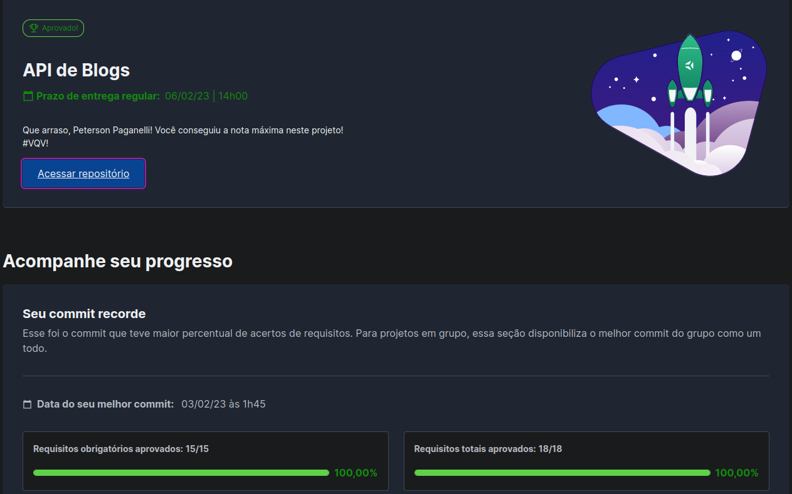

# blogs-api
<h1>Descrição</h1>

  
Projeto desenvolvido na Trybe durante o módulo de Back-End

  
Projeto de criação de um banco de dados e uma API para a construção de um blog. Aplicação feita em Node.js com Sequelize para fazer o CRUD dos posts

  

  
Detalhes

    <ul>
    <li>Endpoints desenvolvidos e conectados com o banco de dados seguindo os princípios REST</li>
    <li>Para a criação, atualização e exclusão de um post é necessário que o usuário esteja logado</li>
    <li>Criado a relação de 'posts' para 'categories' e de 'categories' para 'posts'</li>
  </ul>
   
  

  

<h1>Ferramentas</h1>

  <ul>
    <li>Javascript</li>
    <li>Docker</li>
    <li>Node.js</li>
    <li>Sequelize</li>
    <li>mySQL</li>
  </ul>

<h1>Resultado</h1>

<h1>Contato</h1>

  
  
  
Email: petersonpaganelli@outlook.com

